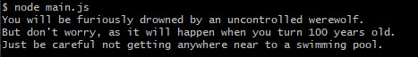
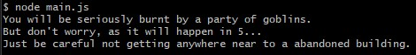

# Mixed Messages
This is a mixed death message generator program. Every time a user runs the program, they should get a new randomized output. The output consists in the way that the person who ran the program is going to die, with four pieces of data (who, how, where and when).


## Table of contents
* [General info](#general-info)
* [Screenshots](#screenshots)
* [Technologies](#technologies)
* [Setup](#setup)
* [Features](#features)
* [Status](#status)
* [Sources](#sources)
* [Contact](#contact)

## General info
The purpose of this project is to take into practice the things I have learned of Javascript, Git and command line from the _Full-Stack Engineer Codecademy Career Path_.

## Screenshots

### Output examples



## Technologies
* Javascript - version ECMAScript 2018
* Git- version 2.30.0
* Command Line

## Setup
Use **Node.js** in the command line to run the program.

```node main.js```

## Features
* Message data created and stored in arrays
* Get the random data from different functions
* Has a single function that returns any data group type
* Returns 'How you will be dying message'

## Status
Project is: _finished_

## Sources
This app is inspired by the _Mixed Messages_ project from the _Full-Stack Engineer Career Path_ of [Codecademy](https://www.codecademy.com)


## Contact
Created by [@didash20](https://github.com/didash20)